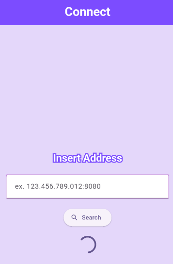
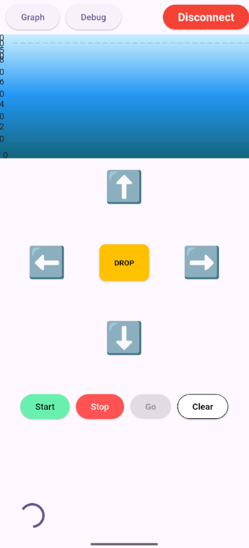

# Aquatic Monitoring System - Mobile Dashboard

A cross-platform mobile application built with Flutter, acting as the primary control center and telemetry dashboard for the Autonomous Aquatic Monitoring & Baiting System. The app communicates directly with the boat's embedded hardware to provide real-time data visualization, route tracking, and manual overrides.

## Project Overview

This repository contains the mobile application component of the larger IoT bait boat system. The app is designed to provide a robust, low-latency interface for users to monitor environmental data, track the boat's position, and manually control its mechanical systems over a TCP network connection.

## Core Features and User Interface

The application is structured around two primary screens to keep the user experience focused and efficient:

### 1. Authentication & Connection Screen
* **Network Pairing:** A streamlined login interface featuring text fields for inputting the embedded system's connection credentials (IP address and port). 
* **Session Initialization:** Establishes a persistent TCP socket connection with the Raspberry Pi Zero 2 W on the mobile unit.

### 2. Control & Telemetry Dashboard
This screen serves as the main operational hub once connected, divided into several functional sections:
* **Manual Control Interface:** Dedicated controls for remote piloting. Includes directional controls for the dual DC motors (steering), speed control for the main BLDC motor (propulsion), and actuation of the servo motor for the bait deployment mechanism.
* **Route Tracking System:** A navigation section dedicated to visualizing the boat's path, utilizing the GPS coordinates transmitted from the mobile unit.
* **Data Visualization (Graphs):** Real-time interactive graphing that plots distance over time, allowing the user to monitor travel efficiency and range.
* **Telemetry & Debugging:** A live data feed displaying raw sensor outputs received from the embedded system, ensuring the connection and sensors are functioning correctly.
* **Historical Logs:** An organized view of historical acquired data, allowing the user to observe environmental changes (like temperature and humidity from the DHT11 sensor) and past system events.

## Communication Architecture

The application relies on a client-server architecture using **TCP Sockets** for communication. 
* The Flutter app acts as the client, sending structured command packets (e.g., motor speeds, servo angles, RTH triggers) to the boat.
* It continuously listens for incoming telemetry streams (GPS coordinates, ultrasonic distance, compass heading, and DHT11 readings) to update the UI state in real-time without polling delays.

## Tech Stack

* **Framework:** Flutter
* **Language:** Dart
* **Networking:** TCP/IP Sockets
* **State Management:** Flutter native state handling / asynchronous streams for socket data
